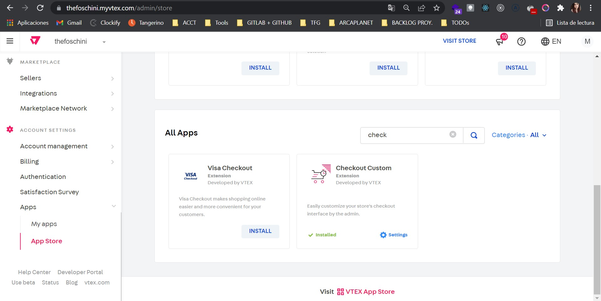
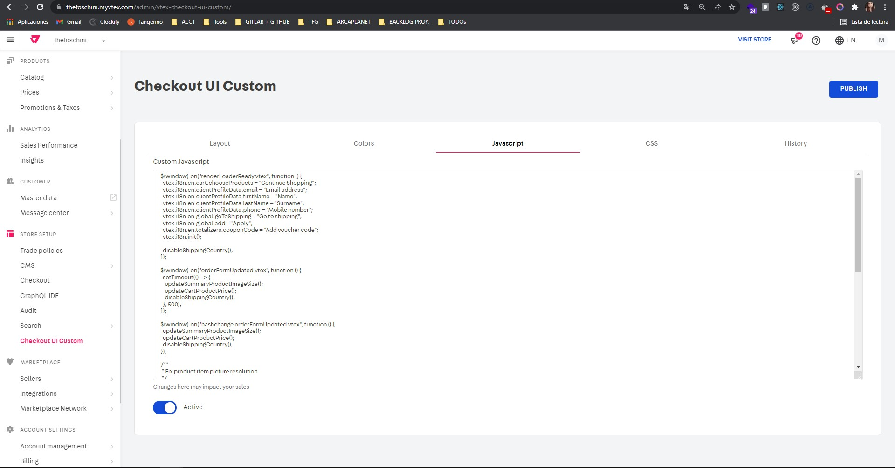

# Custom shipping step by items

Application developed to manage all TFG requirements in the shipping step of the VTEX checkout.
Several changes in the behavior of this step have been requested depending on the items in the customer's cart.
In addition, this app will also manage changes to the customer's address and receiver information.

## Installation

To use this app you must have installed the VTEX checkout version: Checkout Custom. You can do this from the vtex app store (/admin/store) as shown in the example:



You will then install this application from the command console:

```cmd
vtex install custom-shipping-step-by-items@x.x.x
```

**This application only works with Checkout Custom and Google address form integration.**

### Set the configuration

Once installed, the configuration of the application must be included in the Javascript tab inside the ui custom checkout manager (/admin/vtex-checkout-ui-custom/) and enable the flag below.



_Detail of the parameters to be configured_:

- **furnitureId**: furniture product category id

  if there are products with this category in the cart the associated furniture form will be displayed.

- **tvId**: tv product category id

  if there are products in the cart with this category, the field to fill in the TV license will be displayed.

- **simCardId**: simcard product category id

  if there are products with this category identifier in the cart, the message associated to this requirement will be displayed next to the form requested by TFG.

- **furnitureForm**
  - **buildingType**: string array with available values to appear in the selector of buildingType
  - **parkingDistance**: string array with available values to appear in the selector of parkingDistance
  - **deliveryFloor**: string array with available values to appear in the selector of deliveryFloor
  - **liftStairs**: string array with available values to appear in the selector of liftStairs

- **RICAMsg**: text that will appear when the conditions for RICA products are complied with
- **MixedProductsMsg**: text that will appear when in the cart there are furniture category products next to other categories

An example configuration:

```js
function setAppConfiguration(config) {
  config.furnitureId = "1";
  config.tvId = "2";
  config.simCardId = "3";
  config.furnitureForm = {
      buildingType: [
        'Free standing',
        'House in complex',
        'Townhouse',
        'Apartment'
      ],
      parkingDistance: [15, 25, 50, 100],
      deliveryFloor: ['Ground', '1', '2', '3+'],
      liftStairs: ['Lift', 'Stairs']
  };
  config.RICAMsg =
    "You can't collect this order in store because your cart contains items which require either RICA or TV License validation.";
  config.MixedProductsMsg =
    "We'll ship your furniture and other items in your cart to the selected address. Only the furniture delivery fee will apply.";
}
```
### App configuration into orderForm
if you need to add or update the configuration of orderForm, first get the current configuration, then update it

#### Get request:
```js

  const options = {
    method: 'GET',
    headers: {
      'Content-Type': 'application/json',
      Accept: 'application/json',
      'X-VTEX-API-AppKey': 'ApiKey',
      'X-VTEX-API-AppToken': 'AppToken'
    }
  };

  fetch('https://accountname.environment.com.br/api/checkout/pvt/configuration/orderForm', options)
    .then(response => response.json())
    .then(response => console.log(response))
    .catch(err => console.error(err));
```

#### Post request:
```js

  const options = {
    method: 'POST',
    headers: {
      'Content-Type': 'application/json',
      Accept: 'application/json',
      'X-VTEX-API-AppKey': 'ApiKey',
      'X-VTEX-API-AppToken': 'AppToken'
    },
    body: JSON.stringify({
      "paymentConfiguration": {
          "requiresAuthenticationForPreAuthorizedPaymentOption": false,
          "allowInstallmentsMerge": null,
          "blockPaymentSession": null,
          "paymentSystemToCheckFirstInstallment": null,
          "defaultPaymentSystemToApplyOnUserOrderForm": null
      },
      "taxConfiguration": null,
      "minimumQuantityAccumulatedForItems": 1,
      "decimalDigitsPrecision": 2,
      "minimumValueAccumulated": 0,
      "apps": [
          {
              "fields": [
                  "idOrPassport",
                  "sameAddress",
                  "fullName",
                  "streetAddress",
                  "suburb",
                  "city",
                  "postalCode",
                  "province",
                  "country"
              ],
              "id": "ricafields",
              "major": 1
          },{
              "fields": [
                  "tvID"
              ],
              "id": "tvfields",
              "major": "1"
          },{
              "fields": [
                  "furnitureReady",
                  "buildingType",
                  "parkingDistance",
                  "deliveryFloor",
                  "liftOrStairs",
                  "hasSufficientSpace",
                  "assembleFurniture"
              ],
              "id": "furniturefields",
              "major": "1"
          }
      ],
      "allowMultipleDeliveries": true,
      "allowManualPrice": false,
      "savePersonalDataAsOptIn": false,
      "maxNumberOfWhiteLabelSellers": null,
      "maskFirstPurchaseData": null,
      "recaptchaValidation": "never",
      "maskStateOnAddress": true
  })
}
```
#### Vtex documentation:
- [get the orderForm configuration](https://developers.vtex.com/vtex-rest-api/reference/getorderformconfiguration)
- [update the orderForm configuration](https://developers.vtex.com/vtex-rest-api/reference/updateorderformconfiguration)

## How to use?
Once the application has been installed and configured, there are no further steps to be taken.
The behavior required by TFG will be produced automatically in the checkout when the conditions of the configured products are satisfied. The additional fields in the shipping address will also be displayed automatically.

## Dependencies
- ```vtex.checkout-ui-custom@0.7.13```
- ```vtex.checkout-ui-settings-server@0.4.2-hkignore.europe-0```

## Development
- into main folder run `npm i`
- run `vtex link`
- in another terminal, run `cd checkout-ui-custom`
- run `npm i`
- run `npm run watch`

## Checkout styles setup
the styles of this application are stored in the app [tfg-custom-checkout](https://github.com/TFG-Labs/tfg-custom-checkout), please refer to its [documentation](https://github.com/TFG-Labs/tfg-custom-checkout/blob/main/README.md#checkout-styles-setup) to review the process.

## Contributing
Pull requests are welcome. For major changes, please open an issue first to discuss what you would like to change.
